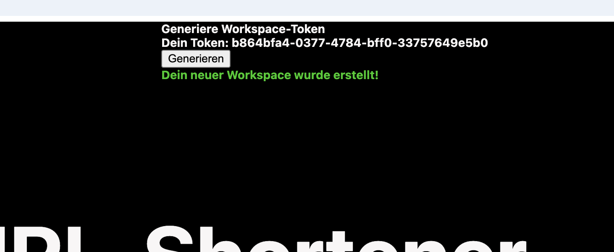
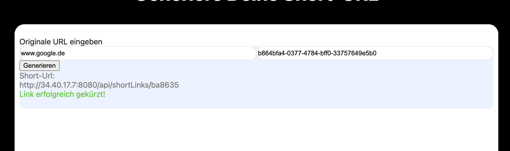
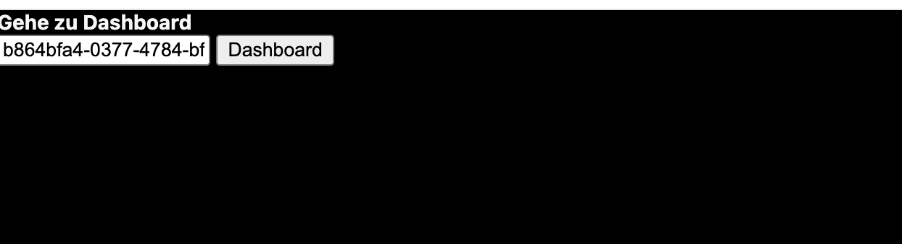
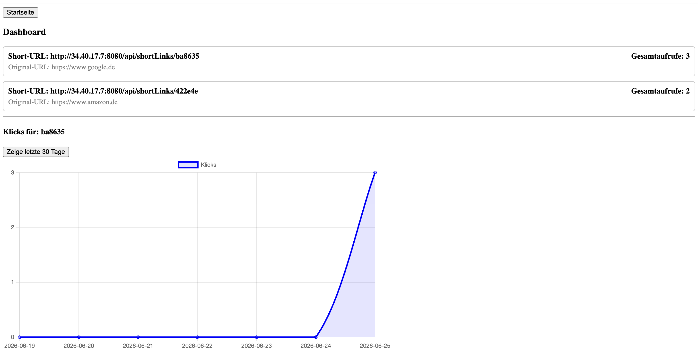

# 🚀 Cloud-Native URL-Shortener
Dieses Projekt ist ein skalierbares, cloud-basiertes URL-Shortener-System. 
Es ermöglicht die Umwandlung von langen URLs in kompakte, leicht teilbare Links. 
Zudem können diese Links in verschiedenen Workspaces organisiert und detaillierte Klick-Statistiken erfasst werden. 
Die Anwendung ist als moderne Microservice-Architektur konzipiert, vollständig containerisiert und verfügt über eine automatisierte Deployment-Pipeline.

## ✨ Features
* Kürzen von langen URLs in kompakte Links
* Erfassung und Auswertung von Klickzahlen für jeden erstellten Kurzlink.
* Aufteilung der Anwendung in unabhängige Services, die lose gekoppelt über REST-APIs kommunizieren.
* Vollautomatisches Deployment auf einen Cloud-Server bei jedem Push in den Haupt-Branch.

## 🛠️ Tech Stack
* **Backend:** Java 17, Spring Boot, Maven
* **Datenbank:** MySQL (Docker), H2 (für lokale Tests)
* **Infrastruktur & DevOps:** Docker, Docker Compose, GitHub Actions (CI/CD), Google Cloud 

## 🏗️ Architektur
Das System ist in vier eigenständige Microservices unterteilt, die jeweils über eine eigene, isolierte Datenbank verfügen:
* **Client-Service:** Dient als primäre Benutzeroberfläche und Schnittstelle zu den Backend-Diensten.
* **Shortener-Service:**  Übernimmt die Kernlogik zur Generierung und Auflösung der Kurz-URLs.
* **Workspace-Service:** Verwaltet die Benutzerbereiche und die Zuordnung der jeweiligen Links.
* **Stats-Service:** Sammelt die Aufrufstatistiken und Klickzahlen der verarbeiteten Links.

## 📀 Installation
**Voraussetzung:** Auf dem lokalen System müssen Docker und Docker Compose installiert sein!  
1. **Klone Projekt**  
```shell
gh repo clone xxxatacion/url-shortener
```

2. **Setze Umgebungsvariablen**  
   (In url-shortener dir)
```shell
cat <<EOF > .env
SHORTENER_PUBLIC_URL=http://localhost:8080/api/shortLinks/
MYSQL_ROOT_PASSWORD=UR_MYSQL_ROOT_PASSWORD
EOF
```
3. **Services starten**  
    (In url-shortener dir)

```shell
docker-compose up -d --build
```
4. **Anwendung öffnen**  
<http://localhost>


## 📖 Nutzung 
1. **Workspace-Token erstellen (optional)**  
Klicke auf Generieren beim Feld "Generiere Workspace-Token". Du erhälst nun einen Token.  

2. **Shortlink erstellen**  
Gebe eine gültige URL im URL-Feld ein.  
   ***optional:*** *Gebe zusätzlich im entsprechenden Feld deinen Workspace-Token ein, um den Link mit deinem Workspace zu verknüpfen.*  
Klicke nun auf Generieren, du erhälst deinen gekürzten Link (Short-Url), der dich auf die angegebene Seite weiterleitet.  
   
3. **Dashboard** *(bei Nutzung mit Workspace-Token)*  
Um zum Dashboard zu gelangen gebe im entsprechenden Feld dein Workspace-Token ein.  
     
Klicke auf Dashboard, nun findest du die Statistiken zu deinen generierten Links, die mit deinem Workspace verknüpft sind.  
   


